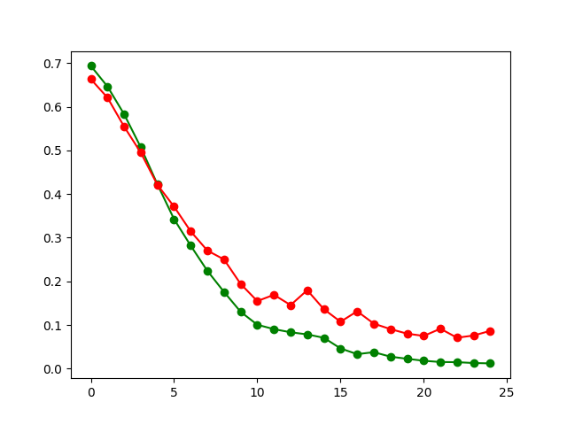
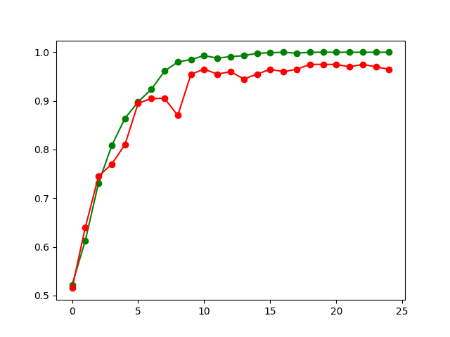

# circle-rectangle-classifier

## DataSet

The dataset is has colored 3 channel (RGB) pictures and I don't think it serves any purpose in classifying them into circles and rectangles. So the first thing I am doing with the pictures is turn them to a single channel grayscaled image. So now the shape will be (64,64) which was (64,64,3) before. After this the images are also normalized (x = x/255)

## NeuralNetwork

My approach is to keep the network as simple as possible to match up with the simplicity of the problem. The neural network with start off with a Conv2D with 32 filters which is a followed by a MaxPool2D. After this the layers are flattened into one dimension and followed by a fully connected dense layer of 16 units which will output to a sigmoid unit.

I will be using Binary Cross Entropy as the loss function because this is a binary classification problem.

    classifier.py makes predictions on a directory of pictures. The directory path can be passed as a command line argument or changed seperately in the file.
    train.py is used to train a model using the dataset given.
    data.py has the preprocessing and fetching functions.

## How to test

Change the path variable in the classifier.py module to the path to the directory of the testing images. Alternatively, the classifier.py could be run directly along with the path as a command line argument. The classifier function could also be imported and used seperately somewhere else.

## Metrics

THIS IS THE CURVE FOR THE LOSS

Red: Validation; Green: Training

THIS IS THE CURVE FOR THE BINARY ACCURACY

Red: Validation; Green: Training
